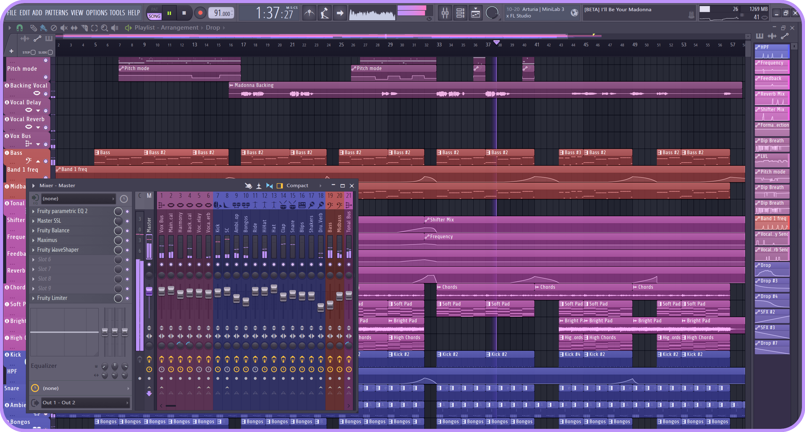

# Dracula for [FL Studio](https://www.image-line.com/)

> A dark theme for [FL Studio](https://www.image-line.com/).

## Install
#### Download manually
Go to Releases and download the Dracula.flstheme file

#### Installing pack
Place the .flstheme file in `C:\Users\[USER]\Documents\Image-Line\FL Studio\Settings\Themes`  
Inside FL Studio, go to `Options` > `General settings` > `Select theme...`  
Select the theme and enjoy!!

## Team

This theme is maintained by the following person(s) and a bunch of [awesome contributors](https://github.com/dracula/foobar/graphs/contributors).

|         |
| ---------------------------------------------------------------------------------------- |
| [DJARUUN](https://github.com/DJAruun)                                                    |

## Community

- [Twitter](https://twitter.com/draculatheme) - Best for getting updates about themes and new stuff.
- [GitHub](https://github.com/dracula/dracula-theme/discussions) - Best for asking questions and discussing issues.
- [Discord](https://draculatheme.com/discord-invite) - Best for hanging out with the community.

## License

[MIT License](./LICENSE)
